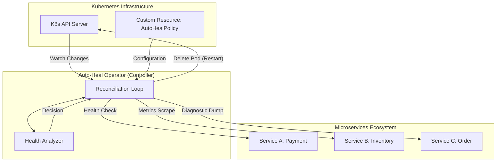
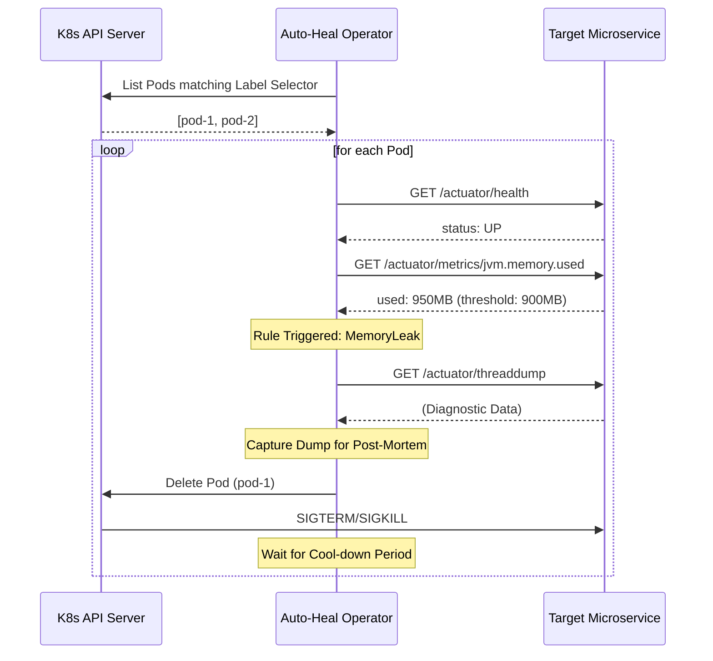

# Spring Boot Auto-Heal Operator

🚀 **A Kubernetes-native controller designed for intelligent self-healing of Spring Boot microservices.**

The **Spring Boot Auto-Heal Operator** bridges the gap between application-level metrics (Spring Boot Actuator) and infrastructure-level management (Kubernetes). It detects and resolves runtime failures—such as memory leaks, thread deadlocks, and GC thrashing—that standard Kubernetes liveness probes often miss.

## ✨ Features

- **Application-Aware Health Checks:** Monitors deep JVM metrics via Spring Boot Actuator.
- **Predictive Remediation:** Detects issues like memory leak patterns before the process crashes.
- **Diagnostic Dumps:** Automatically captures Thread Dumps before restarting a failing Pod for post-mortem analysis.
- **Cool-down Mechanism:** Prevents "restart storms" and infinite crash loops.
- **CRD-Driven:** Configure healing policies per application using simple Kubernetes manifests.

## 🛠 Tech Stack

- **Java 21**
- **Spring Boot 3.2.4**
- **Java Operator SDK** (for Kubernetes controller logic)
- **Fabric8 Kubernetes Client**
- **Maven** (Build tool)
- **K3s** (Target environment)

## 🏗 Architecture & Request Flow

The **Spring Boot Auto-Heal Operator** acts as a centralized "brain" for your microservices ecosystem, monitoring health and performance through a continuous reconciliation loop.

### Architecture Overview


### Request Flow (Reconciliation Loop)


1.  **AutoHealPolicy (CRD):** Defines which Pods to monitor and which rules to apply.
2.  **HealthAnalyzer:** Queries Actuator endpoints (`/actuator/health`, `/actuator/metrics`, `/actuator/threaddump`) to assess JVM health.
3.  **Operator Reconciler:** Executes remediation actions (Restart, RestartWithDump, etc.) based on analysis results.

## 🚀 Quick Start

### 1. Prerequisites
- A running Kubernetes cluster (e.g., K3s, Minikube).
- `kubectl` configured to your cluster.
- Java 21+ installed.

### 2. Install the Custom Resource Definition (CRD)
```bash
kubectl apply -f k8s/crd.yaml
```

### 3. Run the Operator
Locally (using your `kubeconfig`):
```bash
mvn spring-boot:run
```

### 4. Apply a Healing Policy
```yaml
apiVersion: autoheal.io/v1
kind: AutoHealPolicy
metadata:
  name: spring-app-policy
spec:
  coolDownSeconds: 300
  selector:
    app: my-service
  rules:
    - type: MemoryLeak
      threshold: "90%"
      action: RestartWithDump
    - type: ThreadDeadlock
      action: Restart
```
Apply it:
```bash
kubectl apply -f k8s/example-policy.yaml
```

## 🧪 Testing
For a detailed guide on how to simulate failures and verify the operator's behavior, see [TESTING.md](./TESTING.md).

